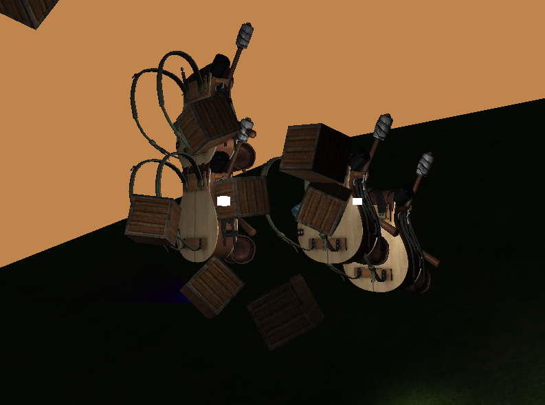
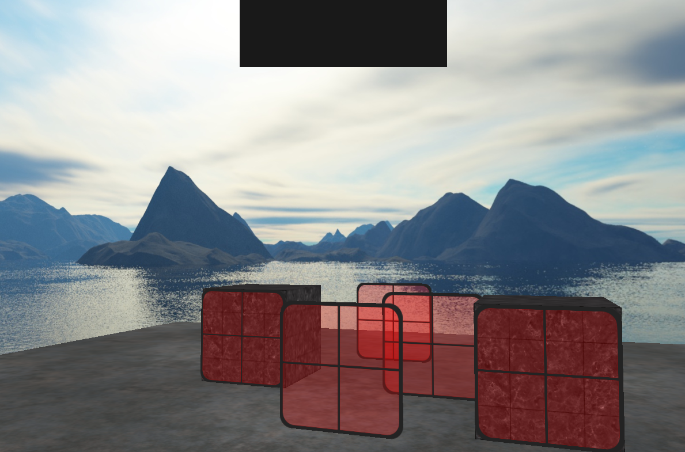
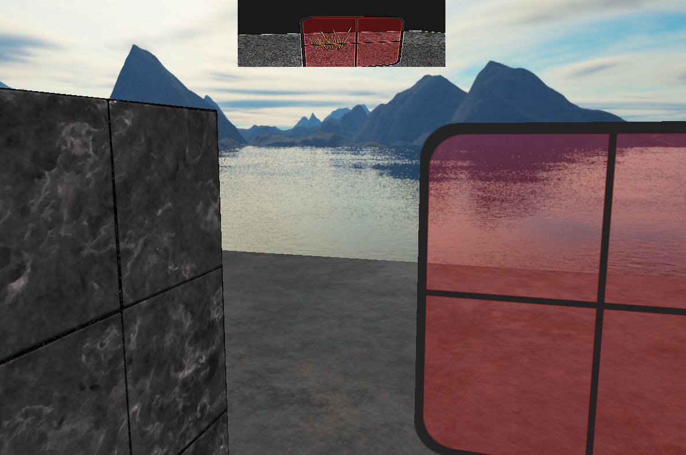

# OpenGL Test Program
Used C++ to make a basic 3D demo and to understand the fundamentals of OpenGL graphics programming. Followed the tutorial on https://learnopengl.com/.

Libraries used:
- GLFW (https://www.glfw.org/)
- CMake (https://cmake.org/)
- GLAD (https://glad.dav1d.de/)

Grass texture from [here](https://www.google.com/search?tbs=simg:CAQSfBp6CxCwjKcIGl4KXAgDEiRpA9oDaNwD1RaHHv0CAdkW2iHXKOAh1ijNKN4p6TflJ5s3nDcaMBLwTNGN9HVgpu6T5Taw8IQsxkoq410eLftAUqsdfa7_1JYz-uqL_1czpPrVm-UxvOeCAEDAsQjq7-CBoKCggIARIE-P99Kww&tbm=isch&sa=X&ved=2ahUKEwjTh5b17ZD8AhVmQjABHSaTD3IQ2A4oAHoECAYQAg&biw=1920&bih=955&dpr=1).

All other assets are from https://learnopengl.com/

## Screenshots
### Lighting demo, using ambient, diffuse, and specular lightning

### Skybox, tinted windows

### "Rearview mirror" at top

## TODO
Make a WebGL version using Three.js
